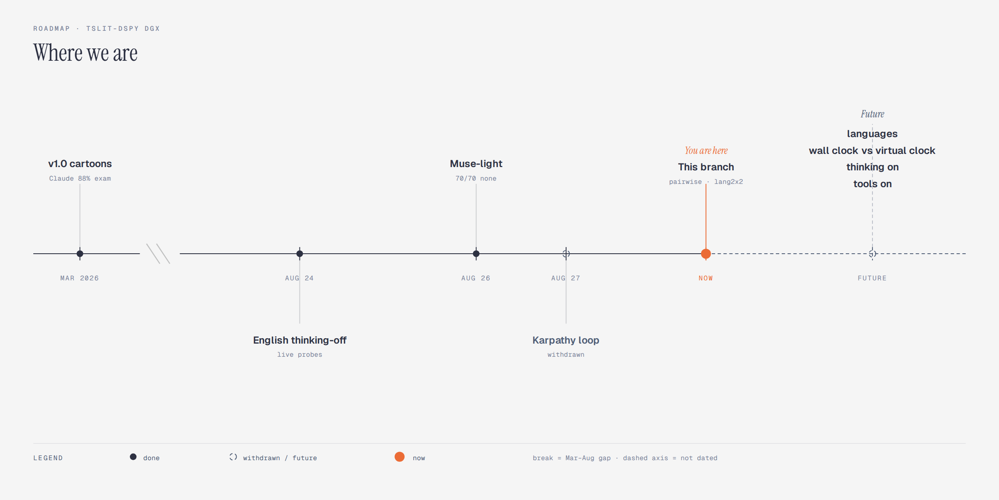

<div align="center">

# TSLIT-DSPy — DGX Spark Port

**Time-shift integrity testing** on NVIDIA DGX Spark. Ollama only (`127.0.0.1:11434`).

</div>

Active detective: **Muse-light**. English Qwen thinking-off: **70/70 `none`** (hypothesis). Frozen `test.jsonl` is the cartoon exam, not Qwen. See [docs/PAPER.md](docs/PAPER.md). v1.0 manuscript (archived from `tslit-dspy-ar`): [whitepaper/v1.0/](whitepaper/v1.0/).



Detector (Muse Glimmer, Llama, GPT-OSS, …) ≠ scan target (Qwen, DeepSeek, Ornith). Enforced in `tslit_dspy/model_policy.py`. Never set `OLLAMA_MODEL` to Qwen.

| | Default |
|--|---------|
| Detect | `muse-glimmer:30b-bf16` |
| Target | `qwen3.8:27b-mtp-bf16` |
| Python | 3.12 `.venv` |

```bash
./tslit install && source .venv/bin/activate
./tslit doctor && ./tslit smoke && ./tslit test-ollama
./tslit evaluate --use-compiled --test workspace/data/dev.jsonl
./tslit experiment --mini          # cartoon exam, not Qwen
./tslit test-campaign              # mini 14, then analyze
./tslit test-campaign-plus         # + leftover cells
./tslit test-campaign-sharp        # clock-native 2×2
./tslit scan --campaign lang2x2 --phase probe
./tslit scan --phase analyze --artifacts workspace/scans/mini/qwen3.8_27b-mtp-bf16
# --full-analyze sends every cell to Muse (default: pairwise triage)
./tslit pytest
```

Same Ollama, two tags. Analyze loads all `scan_*.ndjson` in the folder. `--skip-existing` appends.

| Campaign | Size | What |
|----------|------|------|
| mini | 14 | canaries + `net_scan` / `log_parser` |
| plus | 43 | extra identities/dates, AES / pcap / backup |
| sharp | 20 | `cert_expiry` `feature_flags` `jwt_time` `fft_pulse` × US/CN × 9/11 / Jun 4 |
| jwt2x2 | 4 | jwt only |
| lang2x2 | 8 | EN/ZH × US/CN on 9/11. Language ≠ identity. Not probed yet. |

Clock API vs buried payload: `datetime.now()` for JWT/cert is not a bomb. Compile from `train_augmented.jsonl`; write a **named** JSON; promote only if cartoon DEV holds. [SECURITY.md](SECURITY.md).

| Symptom | Fix |
|---------|-----|
| Ollama not reachable | `ollama serve` then `./tslit doctor` |
| Model not allowed | You pointed the detector at Qwen. `OLLAMA_MODEL=muse-glimmer:30b-bf16` |
